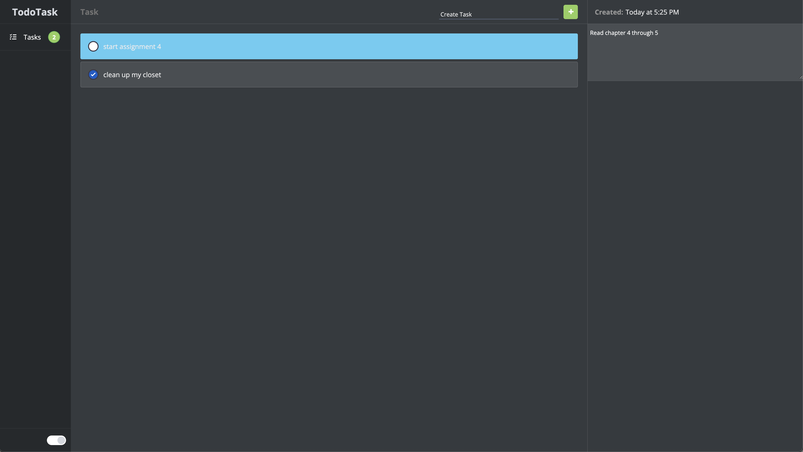

# Todo Task

Todo Task is a task management website that's designed to help organize and prioritize your daily tasks with ease. Its customizable features and clear layout provide a straightforward way to manage your to-do list, enabling you to stay on top of your tasks and boost your productivity.

## Demo

[Live Demo Link](https://todotask-list.netlify.app/)




## Features

- Add tasks with task description
- Edit task description
- Delete tasks
- Check off completed tasks
- Sort tasks by date created
- Dark mode
- Responsive design

## 🛠️ Tech Stack

   

## Getting started

- [ ] Launch your terminal
- [ ] Go to the desired directory where you want to save the file
- [ ] Enter the following command in the terminal prompt

```
git clone https://github.com/khalid-nur/todo-task-with-firebase.git
```

## Author

👥 Khalid Nur

- GitHub: [khalid-nur](https://github.com/khalid-nur)
- LinkedIn: [khalidnur](https://www.linkedin.com/in/khalidnur/)

## 🤝 Contributing

Contributions, issues, and feature requests are welcome! Feel free to check the [issues page](https://github.com/khalid-nur/todo-task-with-firebase/issues).
